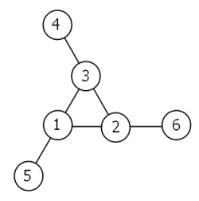

## Problems 51 - 75
### 51 - Prime digit replacements
By replacing the 1st digit of the `2`-digit number `*3`, it turns out that
six of the nine possible values: `13`, `23`, `43`, `53`, `73`, and `83`, are all prime.\
\
By replacing the 3rd and 4th digits of `56**3` with the same digit,
this `5`-digit number is the first example having seven primes among the ten generated
numbers, yielding the family: `56003`, `56113`, `56333`, `56443`, `56663`, `56773`, and
`56993`. Consequently `56003`, being the first member of this family, is the smallest
prime with this property.\
\
Find the smallest prime which, by replacing part of the number (not necessarily
adjacent digits) with the same digit, is part of an eight prime value family.

### 52 - Permuted multiples
It can be seen that the number, `125874`, and its double, `251748`,
contain exactly the same digits, but in a different order.\
\
Find the smallest positive integer, `x`, such that `2x`, `3x`, `4x`,
`5x`, and `6x`, contain the same digits.

### 53 - Combinatoric selections
There are exactly ten ways of selecting three from five, `12345`:

<code>123</code>, <code>124</code>, <code>125</code>, <code>134</code>,
<code>135</code>, <code>145</code>, <code>234</code>, <code>235</code>,
<code>245</code>, and <code>345</code>

In combinatorics, we use the notation, `(5 choose 3) = 10`.\
\
In general, `(n choose r) = n! / r!(n - r)!`, where `r <= n`,
`n! = n × (n - 1) × ... × 3 × 2 × 1`, and `0! = 1`.\
\
It is not until `n = 23` that a value exceeds one-million: `(23 choose 10) = 1144066`.\
\
How many, not necessarily distinct, values of `(n choose r)` for `1 <= n <= 100`, are
greater than one-million?

### 54 - Poker hands
In the card game poker, a hand consists of five cards and are ranked, from lowest
to highest, in the following way:
- **High Card**: Highest value card.
- **One Pair**: Two cards of the same value.
- **Two Pairs**: Two different pairs.
- **Three of a Kind**: Three cards of the same value.
- **Straight**: All cards are consecutive values.
- **Flush**: All cards of the same suit.
- **Full House**: Three of a kind and a pair.
- **Four of a Kind**: Four cards of the same value.
- **Straight Flush**: All cards are consecutive values of same suit.
- **Royal Flush**: Ten, Jack, Queen, King, Ace, in same suit.

The cards are valued in the order:\
2, 3, 4, 5, 6, 7, 8, 9, 10, Jack, Queen, King, Ace.\
\
If two players have the same ranked hands then the rank made up of the highest value
wins; for example, a pair of eights beats a pair of fives (see example 1 below). But
if two ranks tie, for example, both players have a pair of queens, then highest cards
in each hand are compared (see example 4 below); if the highest cards tie then
the next highest cards are compared, and so on.\
\
Consider the following five hands dealt to two players:

<table align="center">
<thead align="center"><td><b>Hand</b></td><td><b>Player 1</b></td>
<td><b>Player 2</b></td><td><b>Winner</b></td></thead>

<tr align="center"><td><b>1</b></td><td>5H 5C 6S 7S KD <i>Pair of Fives</i></td>
<td>2C 3S 8S 8D TD <i>Pair of Eights</i></td><td>Player 2</td></tr>

<tr align="center"><td><b>2</b></td><td>5D 8C 9S JS AC <i>Highest card Ace</i></td>
<td>2C 5C 7D 8S QH <i>Highest card Queen</i></td><td>Player 1</td></tr>

<tr align="center"><td><b>3</b></td><td>2D 9C AS AH AC <i>Three Aces</i></td>
<td>3D 6D 7D TD QD <i>Flush  with Diamonds</i></td><td>Player 2</td></tr>

<tr align="center"><td><b>4</b></td><td>4D 6S 9H QH QC <i>Pair of Queens Highest card Nine</i></td>
<td>3D 6D 7H QD QS <i>Pair of Queens Highest card Seven</i></td><td>Player 1</td></tr>

<tr align="center"><td><b>5</b></td><td>2H 2D 4C 4D 4S <i>Full House with Three Fours</i></td>
<td>3C 3D 3S 9S 9D <i>Full House with Three Threes</i></td><td>Player 1</td></tr>
</table>

The file, [`p054_poker.txt`](../../res/p054_poker.txt), contains one-thousand random hands
dealt to two players. Each line of the file contains ten cards (separated by a single
space): the first five are Player 1's cards and the last five are Player 2's cards.
You can assume that all hands are valid (no invalid characters or repeated cards),
each player's hand is in no specific order, and in each hand there is a clear winner.\
\
How many hands does Player 1 win?

### 55 - Lychrel numbers
If we take `47`, reverse and add, `47 + 74 = 121`, which is palindromic.\
\
Not all numbers produce palindromes so quickly. For example,

<code>349 + 943 = 1292</code>
<code>1292 + 2921 = 4213</code>
<code>4213 + 3124 = 7337</code>

That is, `349` took three iterations to arrive at a palindrome.\
\
Although no one has proved it yet, it is thought that some numbers,
like `196`, never produce a palindrome. A number that never forms
a palindrome through the reverse and add process is called a Lychrel
number. Due to the theoretical nature of these numbers, and for the
purpose of this problem, we shall assume that a number is Lychrel until
proven otherwise. In addition you are given that for every number below
ten-thousand, it will either
- (i) become a palindrome in less than fifty iterations, or,
- (ii) no one, with all the computing power that exists, has managed so far to map
it to a palindrome. In fact, `10677` is the first number to be shown to require over
fifty iterations before producing a palindrome: `4668731596684224866951378664` (53
iterations, 28-digits).\
\
Surprisingly, there are palindromic numbers that are themselves Lychrel numbers;
the first example is `4994`.\
\
How many Lychrel numbers are there below ten-thousand?

### 56 - Powerful digit sum

A googol (<code>10100</code>) is a massive number: one
followed by one-hundred zeros; <code>100100</code> is almost
unimaginably large: one followed by two-hundred zeros. Despite their
size, the sum of the digits in each number is only <code>1</code>.

Considering natural numbers of the form, <code>ab</code>,
where <code>a, b < 100</code>, what is the maximum digital sum?

### 57 - Square root convergents
It is possible to show that the square root of two can be expressed as an infinite
continued fraction.

By expanding this for the first four iterations, we get:

 
 
 

The next three expansions are
,
 and
,
but the eighth expansion,
,
is the first example where the number of digits in the numerator exceeds the number
of digits in the denominator.

In the first one-thousand expansions, how many fractions contain a numerator with
more digits than the denominator?

### 58 - Spiral primes
Starting with `1` and spiralling anticlockwise in the following way, a square spiral
with side length 7 is formed.

<code><b>37</b> 36 35 34 33 32 <b>31</b></code> 
<code>38 <b>17</b> 16 15 14 <b>13</b> 30</code> 
<code>39 18&nbsp;&nbsp;<b>5</b>&nbsp;&nbsp;4&nbsp;&nbsp;<b>3</b> 12 29</code> 
<code>40 19&nbsp;&nbsp;6&nbsp;&nbsp;1&nbsp;&nbsp;2 11 28</code> 
<code>41 20&nbsp;&nbsp;<b>7</b>&nbsp;&nbsp;8&nbsp;&nbsp;9 10 27</code> 
<code>42 21 22 23 24 25 26</code> 
<code><b>43</b> 44 45 46 47 48 49</code>

It is interesting to note that the odd squares lie along the bottom right diagonal,
but what is more interesting is that 8 out of the 13 numbers lying along both
diagonals are prime; that is, a ratio of `8/13 ≈ 62%`.\
\
If one complete new layer is wrapped around the spiral above, a square spiral with
side length 9 will be formed. If this process is continued, what is the side length
of the square spiral for which the ratio of primes along both diagonals first falls
below `10%`?

### 59 - XOR decryption
Each character on a computer is assigned a unique code and the preferred standard is
ASCII (American Standard Code for Information Interchange). For example, uppercase
`A = 65`, asterisk `(*) = 42`, and lowercase `k = 107`.\
\
A modern encryption method is to take a text file, convert the bytes to ASCII, then
`XOR` each byte with a given value, taken from a secret key. The advantage with the
`XOR` function is that using the same encryption key on the cipher text, restores
the plain text; for example, `65 XOR 42 = 107`, then `107 XOR 42 = 65`.\
\
For unbreakable encryption, the key is the same length as the plain text message,
and the key is made up of random bytes. The user would keep the encrypted message
and the encryption key in different locations, and without both "halves", it is
impossible to decrypt the message.\
\
Unfortunately, this method is impractical for most users, so the modified method is
to use a password as a key. If the password is shorter than the message, which is
likely, the key is repeated cyclically throughout the message. The balance for this
method is using a sufficiently long password key for security, but short enough to
be memorable.\
\
Your task has been made easy, as the encryption key consists of three lower case
characters. Using [`p059_cipher.txt`](../../res/p059_cipher.txt), a file containing
the encrypted ASCII codes, and the knowledge that the plain text must contain common
English words, decrypt the message and find the sum of the ASCII values in
the original text.

### 60 - Prime pair sets
The primes `3`, `7`, `109`, and `673`, are quite remarkable. By taking any two primes
and concatenating them in any order the result will always be prime. For example,
taking `7` and `109`, both `7109` and `1097` are prime. The sum of these four primes,
`792`, represents the lowest sum for a set of four primes with this property.\
\
Find the lowest sum for a set of five primes for which any two primes concatenate to
produce another prime.

### 61 - Cyclical figurate numbers
Triangle, square, pentagonal, hexagonal, heptagonal, and octagonal
numbers are all figurate (polygonal) numbers and are generated by
the following formulae:

Triangle&nbsp;&nbsp;&nbsp;&nbsp;&nbsp;&nbsp;&nbsp;&nbsp;&nbsp;
<code>P3,n = n(n+1)/2</code>
&nbsp;&nbsp;&nbsp;&nbsp;&nbsp;&nbsp;&nbsp;<code>1</code>, <code>3</code>, <code>6</code>,
<code>10</code>, <code>15</code>, ... 
Square&nbsp;&nbsp;&nbsp;&nbsp;&nbsp;&nbsp;&nbsp;&nbsp;&nbsp;&nbsp;
<code>P4,n = n2</code>
&nbsp;&nbsp;&nbsp;&nbsp;&nbsp;&nbsp;&nbsp;&nbsp;&nbsp;&nbsp;&nbsp;&nbsp;&nbsp;&nbsp;&nbsp;&nbsp;&nbsp;&nbsp;
<code>1</code>, <code>4</code>, <code>9</code>,
<code>16</code>, <code>25</code>, ... 
Pentagonal&nbsp;&nbsp;&nbsp;&nbsp;&nbsp;<code>P5,n = n(3n−1)/2</code>
&nbsp;&nbsp;&nbsp;&nbsp;&nbsp;<code>1</code>, <code>5</code>, <code>12</code>,
<code>22</code>, <code>35</code>, ... 
Hexagonal&nbsp;&nbsp;&nbsp;&nbsp;&nbsp;&nbsp;<code>P6,n = n(2n−1)</code>
&nbsp;&nbsp;&nbsp;&nbsp;&nbsp;&nbsp;&nbsp;&nbsp;&nbsp;<code>1</code>, <code>6</code>,
<code>15</code>, <code>28</code>, <code>45</code>, ... 
Heptagonal&nbsp;&nbsp;&nbsp;&nbsp;&nbsp;<code>P7,n = n(5n−3)/2</code>
&nbsp;&nbsp;&nbsp;&nbsp;&nbsp;<code>1</code>, <code>7</code>,
<code>18</code>, <code>34</code>, <code>55</code>, ... 
Octagonal&nbsp;&nbsp;&nbsp;&nbsp;&nbsp;&nbsp;&nbsp;<code>P8,n = n(3n−2)</code>
&nbsp;&nbsp;&nbsp;&nbsp;&nbsp;&nbsp;&nbsp;&nbsp;&nbsp;<code>1</code>, <code>8</code>,
<code>21</code>, <code>40</code>, <code>65</code>, ...

The ordered set of three `4`-digit numbers: `8128`, `2882`, `8281`, has three
interesting properties.

<ol>
<li>The set is cyclic, in that the last two digits of each number is the first two
digits of the next number (including the last number with the first).</li>
<li>Each polygonal type: triangle (<code>P3,127 = 8128</code>), square
(<code>P4,91 = 8281</code>), and pentagonal
(<code>P5,44 = 2882</code>), is represented by a different number in
the set.</li>
<li>This is the only set of `4`-digit numbers with this property.</li>
</ol>

Find the sum of the only ordered set of six cyclic `4`-digit numbers for which each
polygonal type: triangle, square, pentagonal, hexagonal, heptagonal, and octagonal,
is represented by a different number in the set.

### 62 - Cubic permutations

The cube, <code>41063625 (3453)</code>, can be permuted to produce two
other cubes: <code>56623104 (3843)</code> and
<code>66430125 (4053)</code>. In fact, <code>41063625</code> is
the smallest cube which has exactly three permutations of its digits which are also
cube.

Find the smallest cube for which exactly five permutations of its digits are cube.

### 63 - Powerful digit counts

The <code>5</code>-digit number, <code>16807 = 75</code>,
is also a fifth power. Similarly, the 9-digit number,
<code>134217728 = 89</code>, is a ninth power.

How many `n`-digit positive integers exist which are also
an `n`th power?

### 64 - Odd period square roots
All square roots are periodic when written as continued fractions and can be written
in the form:

For example, let us consider
:

If we continue, we get the following expansion:

The process can be summarised as follows:

 
 
 
 
 
 
 

It can be seen, that the sequence is repeating. For conciseness, we use the notation
, to indicate
that the block <code>(1, 3, 1, 8)</code> repeats indefinitely.

The first ten continued fraction representations of (irrational) square roots are:

,
<code>period = 1</code> 
,
<code>period = 2</code> 
,
<code>period = 1</code> 
,
<code>period = 2</code> 
,
<code>period = 4</code> 
,
<code>period = 2</code> 
,
<code>period = 1</code> 
,
<code>period = 2</code> 
,
<code>period = 2</code> 
,
<code>period = 5</code> 

Exactly four continued fractions, for `N <= 13`, have an odd period.\
\
How many continued fractions for `N <= 10 000` have an odd period?

### 65 - Convergents of `e`
The square root of `2` can be written as an infinite continued fraction.

The infinite continued fraction can be written,
,
<code>(2)</code> indicates that <code>2</code> repeats <i>ad infinitum</i>. In a similar way,
.

It turns out that the sequence of partial values of continued fractions for square
roots provide the best rational approximations. Let us consider the convergents for
.

 
 
 

Hence the sequence of the first ten convergents for

are: 

What is most surprising is that the important mathematical constant, 
.

The first ten terms in the sequence of convergents for <code>e</code> are: 

The sum of digits in the numerator of the 10th convergent is
`1 + 4 + 5 + 7 = 17`.\
\
Find the sum of digits in the numerator of the 100th convergent of
the continued fraction for `e`.

### 66 - Diophantine equation
Consider quadratic Diophantine equations of the form:

<code>x2 - Dy2 = 1</code>

For example, when <code>D = 13</code>, the minimal solution in <code>x</code> is
<code>6492 - 13 × 1802 = 1</code>.

It can be assumed that there are no solutions in positive integers when `D` is square.\
\
By finding minimal solutions in `x` for `D = {2, 3, 5, 6, 7}`, we obtain
the following:

<code>32 - 2 × 22 = 1</code> 
<code>22 - 3 × 12 = 1</code> 
<code><b>9</b>2 - 5 × 42 = 1</code> 
<code>52 - 6 × 22 = 1</code> 
<code>82 - 7 × 32 = 1</code>

Hence, by considering minimial solutions in `x` for `D <= 7`, the largest `x` is
obtained when `D = 5`.\
\
Find the value of `D <= 1000` in minimal solutions of `x` for which the largest
value of `x` is obtained.

### 67 - Maximum path sum II
By starting at the top of the triangle below and moving to adjacent numbers on
the row below, the maximum total from top to bottom is `23`.

<code><b>3</b></code> 
<code><b>7</b> 4</code> 
<code>2 <b>4</b> 6 </code> 
<code>8 5 <b>9</b> 3</code>

That is, `3 + 7 + 4 + 9 = 23`.\
\
Find the maximum total from top to bottom in
[`p067_triangle.txt`](../../res/p067_triangle.txt), a 15K text file containing
a triangle with one-hundred rows.

<b>NOTE:</b> This is a much more difficult version of Problem 18. It is not possible
to try every route to solve this problem, as there are <code>299</code>
altogether! If you could check one trillion (<code>1012</code>) routes
every second it would take over twenty billion years to check them all. There is
an efficient algorithm to solve it. ;o) 

### 68 - Magic 5-gon ring
Consider the following "magic" `3`-gon ring, filled with the numbers `1` to `6`, and
each line adding to nine.

Working **clockwise**, and starting from the group of three with the numerically
lowest external node (`4`,`3`,`2` in this example), each solution can be described
uniquely. For example, the above solution can be described by the set: `4,3,2`;
`6,2,1`; `5,1,3`.\
\
It is possible to complete the ring with four different totals: `9`, `10`, `11`,
and `12`. There are eight solutions in total.

<table align="center">
<thead align="center"><td><b>Total</b></td><td><b>Solution Set</b></td></thead>
<tr align="center"><td><code>9</code></td>
<td><code>4,2,3</code>; <code>5,3,1</code>; <code>6,1,2</code></td></tr>
<tr align="center"><td><code>9</code></td>
<td><code>4,3,2</code>; <code>6,2,1</code>; <code>5,1,3</code></td></tr>
<tr align="center"><td><code>10</code></td>
<td><code>2,3,5</code>; <code>4,5,1</code>; <code>6,1,3</code></td></tr>
<tr align="center"><td><code>10</code></td>
<td><code>2,5,3</code>; <code>6,3,1</code>; <code>4,1,5</code></td></tr>
<tr align="center"><td><code>11</code></td>
<td><code>1,4,6</code>; <code>3,6,2</code>; <code>5,2,4</code></td></tr>
<tr align="center"><td><code>11</code></td>
<td><code>1,6,4</code>; <code>5,4,2</code>; <code>3,2,6</code></td></tr>
<tr align="center"><td><code>12</code></td>
<td><code>1,5,6</code>; <code>2,6,4</code>; <code>3,4,5</code></td></tr>
<tr align="center"><td><code>12</code></td>
<td><code>1,6,5</code>; <code>3,5,4</code>; <code>2,4,6</code></td></tr>
</table>

By concatenating each group it is possible to form `9`-digit strings; the maximum
string for a `3`-gon ring is `432621513`.\
\
Using the numbers `1` to `10`, and depending on arrangements, it is possible to form
`16`- and `17`-digit strings. What is the maximum **`16`-digit** string for
a "magic" `5`-gon ring?

### 69 - Totient maximum
Euler's Totient function, `φ(n)` (sometimes called the phi function),
is used to determine the number of numbers less than `n` which are
relatively prime to `n`. For example, as `1`, `2`, `4`, `5`, `7`,
and `8`, are all less than nine and relatively prime to nine,
`φ(9)=6`.

<table align="center">
<thead align="center">
<td><b><code>n</code></b></td>
<td><b>Relatively Prime</b></td>
<td><b><code>φ(n)</code></b></td>
<td><b><code>n/φ(n)</code></b></td>
</thead>
<tr align="center"><td><code>2</code></td><td><code>1</code></td>
<td><code>1</code></td><td><code>2</code></td></tr>
<tr align="center"><td><code>3</code></td>
<td><code>1</code>,<code>2</code></td>
<td><code>2</code></td>
<td><code>1.5</code></td></tr>
<tr align="center"><td><code>4</code></td>
<td><code>1</code>,<code>3</code></td>
<td><code>2</code></td>
<td><code>2</code></td></tr>
<tr align="center"><td><code>5</code></td>
<td><code>1</code>,<code>2</code>,<code>3</code>,<code>4</code></td>
<td><code>4</code></td>
<td><code>1.25</code></td></tr>
<tr align="center"><td><code>6</code></td>
<td><code>1</code>,<code>5</code></td>
<td><code>2</code></td>
<td><code>3</code></td></tr>
<tr align="center"><td><code>7</code></td>
<td><code>1</code>,<code>2</code>,<code>3</code>,<code>4</code>,
<code>5</code>,<code>6</code></td>
<td><code>6</code></td>
<td><code>1.1666...</code></td></tr>
<tr align="center"><td><code>8</code></td>
<td><code>1</code>,<code>3</code>,<code>5</code>,<code>7</code></td>
<td><code>4</code></td>
<td><code>2</code></td></tr>
<tr align="center"><td><code>9</code></td>
<td><code>1</code>,<code>2</code>,<code>4</code>,<code>5</code>,
<code>7</code>,<code>8</code></td>
<td><code>6</code></td>
<td><code>1.5</code></td></tr>
<tr align="center"><td><code>10</code></td>
<td><code>1</code>,<code>3</code>,<code>7</code>,<code>9</code></td>
<td><code>4</code></td>
<td><code>2.5</code></td></tr>
</table>

It can be seen that `n = 6` produces a maximum `n/φ(n)` for `n ≤ 10`.\
\
Find the value of `n ≤ 1 000 000` for which `n/φ(n)` is a maximum.

### 70 - Totient permutation
Euler's Totient function, `φ(n)` (sometimes called the phi function), is used
to determine the number of positive numbers less than or equal to `n` which are
relatively prime to `n`. For example, as `1`, `2`, `4`, `5`, `7`, and `8`, are all
less than nine and relatively prime to nine, `φ(9) = 6`.\
The number `1` is considered to be relatively prime to every positive number,
so `φ(1) = 1`.\
\
Interestingly, `φ(87109) = 79180`, and it can be seen that `87109` is a permutation
of `79180`.\

Find the value of <code>n</code>, <code>1 < n < 107</code>, for which
<code>φ(n)</code> is a permutation of <code>n</code> and the ratio <code>n/φ(n)</code>
produces a minimum.

### 71 - Ordered fractions
Consider the fraction, `n/d`, where n and d are positive integers. If `n < d` and
`HCF(n,d) = 1`, it is called a reduced proper fraction.\
\
If we list the set of reduced proper fractions for `d ≤ 8` in ascending order
of size, we get:

<code>1/8</code>, <code>1/7</code>, <code>1/6</code>, <code>1/5</code>,
<code>1/4</code>, <code>2/7</code>, <code>1/3</code>, <code>3/8</code>,
<code><b>2/5</b></code>, <code>3/7</code>, <code>1/2</code>, <code>4/7</code>,
<code>3/5</code>, <code>5/8</code>, <code>2/3</code>, <code>5/7</code>,
<code>3/4</code>, <code>4/5</code>, <code>5/6</code>, <code>6/7</code>,
<code>7/8</code>

It can be seen that `2/5` is the fraction immediately to the left of `3/7`.\
\
By listing the set of reduced proper fractions for `d ≤ 1 000 000` in ascending
order of size, find the numerator of the fraction immediately to the left of `3/7`.

### 72 - Counting fractions
Consider the fraction, `n/d`, where n and d are positive integers. If `n < d` and
`HCF(n,d) = 1`, it is called a reduced proper fraction.\
\
If we list the set of reduced proper fractions for `d ≤ 8` in ascending order
of size, we get:

<code>1/8</code>, <code>1/7</code>, <code>1/6</code>, <code>1/5</code>,
<code>1/4</code>, <code>2/7</code>, <code>1/3</code>, <code>3/8</code>,
<code>2/5</code>, <code>3/7</code>, <code>1/2</code>, <code>4/7</code>,
<code>3/5</code>, <code>5/8</code>, <code>2/3</code>, <code>5/7</code>,
<code>3/4</code>, <code>4/5</code>, <code>5/6</code>, <code>6/7</code>,
<code>7/8</code>

It can be seen that there are 21 elements in this set.\
\
How many elements would be contained in the set of reduced proper fractions for
`d ≤ 1 000 000`?

### 73 - Counting fractions in a range
Consider the fraction, `n/d`, where n and d are positive integers. If `n < d` and
`HCF(n,d) = 1`, it is called a reduced proper fraction.\
\
If we list the set of reduced proper fractions for `d ≤ 8` in ascending order
of size, we get:

<code>1/8</code>, <code>1/7</code>, <code>1/6</code>, <code>1/5</code>,
<code>1/4</code>, <code>2/7</code>, <code>1/3</code>, <code><b>3/8</b></code>,
<code><b>2/5</b></code>, <code><b>3/7</b></code>, <code>1/2</code>, <code>4/7</code>,
<code>3/5</code>, <code>5/8</code>, <code>2/3</code>, <code>5/7</code>,
<code>3/4</code>, <code>4/5</code>, <code>5/6</code>, <code>6/7</code>,
<code>7/8</code>

It can be seen that there are 3 fractions between `1/3` and `1/2`.\
\
How many fractions lie between `1/3` and `1/2` in the sorted set of reduced proper
fractions for `d ≤ 12 000`?

### 74 - Digit factorial chains
The number `145` is well known for the property that the sum of the factorial of
its digits is equal to `145`:\
\
`1! + 4! + 5! = 1 + 24 + 120 = 145`\
\
Perhaps less well known is `169`, in that it produces the longest chain of numbers
that link back to `169`; it turns out that there are only three such loops that
exist:\
\
`169 → 363601 → 1454 → 169`\
`871 → 45361 → 871`\
`872 → 45362 → 872`\
\
It is not difficult to prove that every starting number will eventually get stuck
in a loop. For example,\
\
`69 → 363600 → 1454 → 169 → 363601 (→ 1454)`\
`78 → 45360 → 871 → 45361 (→ 871)`\
`540 → 145 (→ 145)`\
\
Starting with `69` produces a chain of five non-repeating terms, but the longest
non-repeating chain with a starting number below one million is sixty terms.\
\
How many chains, with a starting number below one million, contain exactly sixty
non-repeating terms?

### 75 - Singular integer right triangles
It turns out that `12 cm` is the smallest length of wire that can be
bent to form an integer sided right angle triangle in exactly one
way, but there are many more examples.\

<code><b>12 cm:</b> (3,4,5)</code> 
<code><b>24 cm:</b> (6,8,10)</code> 
<code><b>30 cm:</b> (5,12,13)</code> 
<code><b>36 cm:</b> (9,12,15)</code> 
<code><b>40 cm:</b> (8,15,17)</code> 
<code><b>48 cm:</b> (12,16,20)</code>

In contrast, some lengths of wire, like `20 cm`, cannot be bent to
form an integer sided right angle triangle, and other lengths allow
more than one solution to be found; for example, using `120 cm` it
is possible to form exactly three different integer sided right
angle triangles.

<code><b>120 cm:</b> (30,40,50), (20,48,52), (24,45,51)</code>

Given that `L` is the length of the wire, for how many values of
`L ≤ 1 500 000` can exactly one integer sided right angle triangle
be formed?
