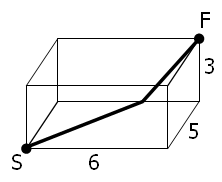

## Problems 76 - 100
### 76 - Counting summations
It is possible to write five as a sum in exactly six different ways:\
\
`4 + 1`\
`3 + 2`\
`3 + 1 + 1`\
`2 + 2 + 1`\
`2 + 1 + 1 + 1`\
`1 + 1 + 1 + 1 + 1`\
\
How many different ways can one hundred be written as a sum of at least two positive
integers?

### 77 - Prime summations
It is possible to write ten as the sum of primes in exactly five different ways:\
\
`7 + 3`\
`5 + 5`\
`5 + 3 + 2`\
`3 + 3 + 2 + 2`\
`2 + 2 + 2 + 2 + 2`\
\
What is the first value which can be written as the sum of primes in over five
thousand different ways?

### 78 - Coin partitions
Let `p(n)` represent the number of different ways in which `n` coins can be
separated into piles. For example, five coins can be separated into piles in
exactly seven different ways, so `p(5)=7`.\
\
OOOOO\
OOOO&nbsp;&nbsp;O\
OOO&nbsp;&nbsp;OO\
OOO&nbsp;&nbsp;O&nbsp;&nbsp;O\
OO&nbsp;&nbsp;OO&nbsp;&nbsp;O\
OO&nbsp;&nbsp;O&nbsp;&nbsp;O&nbsp;&nbsp;O\
O&nbsp;&nbsp;O&nbsp;&nbsp;O&nbsp;&nbsp;O&nbsp;&nbsp;O\
\
Find the least value of `n` for which `p(n)` is divisible by one million.

### 79 - Passcode derivation
A common security method used for online banking is to ask the user for three
random characters from a passcode. For example, if the passcode was `531278`, they
may ask for the 2nd, 3rd, and 5th characters; the expected reply would be: `317`.\
\
The text file, [`p079_keylog.txt`](../../res/p079_keylog.txt), contains fifty
successful login attempts.\
\
Given that the three characters are always asked for in order, analyse the file so
as to determine the shortest possible secret passcode of unknown length.

### 80 - Square root digital expansion
It is well known that if the square root of a natural number is not an integer,
then it is irrational. The decimal expansion of such square roots is infinite
without any repeating pattern at all.\
\
The square root of two is `1.41421356237309504880...`, and the digital sum of the
first one hundred decimal digits is `475`.\
\
For the first one hundred natural numbers, find the total of the digital sums of
the first one hundred decimal digits for all the irrational square roots.

### 81 - Path sum: two ways
In the `5` by `5` matrix below, the minimal path sum from the top left to
the bottom right, by only moving to the right and down, is indicated in bold and
is equal to `2427`.

Find the minimal path sum from the top left to the bottom right by only moving
right and down in [`p081_matrix.txt`](../../res/p081_matrix.txt), a 31K text file
containing an `80` by `80` matrix.

### 82 - Path sum: three ways
**NOTE:** This problem is a more challenging version of Problem 81.\
\
The minimal path sum in the `5` by `5` matrix below, by starting in any cell in
the left column and finishing in any cell in the right column, and only moving up,
down, and right, is indicated in bold; the sum is equal to `994`.

Find the minimal path sum from the left column to the right column in
[`p082_matrix.txt`](../../res/p082_matrix.txt), a 31K text file containing an `80` by
`80` matrix.

### 83 - Path sum: four ways
**NOTE:** This problem is a significantly more challenging version of Problem 81.\
\
In the `5` by `5` matrix below, the minimal path sum from the top left to the bottom
right, by moving left, right, up, and down, is indicated in bold and is equal to
`2297`.

Find the minimal path sum from the top left to the bottom right by only moving
left, right, up and down in [`p083_matrix.txt`](../../res/p083_matrix.txt), a 31K
text file containing an `80` by `80` matrix.

### 84 - Monopoly odds
In the game, *Monopoly*, the standard board is set up in the following way:

A player starts on the `GO` square and adds the scores on two `6`-sided dice to
determine the number of squares they advance in a clockwise direction. Without any
further rules we would expect to visit each square with equal probability: `2.5%`.
However, landing on `G2J` (Go To Jail), `CC` (community chest), and `CH` (chance)
changes this distribution.\
\
In addition to `G2J`, and one card from each of `CC` and `CH`, that orders the player
to go directly to jail, if a player rolls three consecutive doubles, they do not
advance the result of their 3rd roll. Instead they proceed directly to jail.\
\
At the beginning of the game, the `CC` and `CH` cards are shuffled. When a player
lands on `CC` or `CH` they take a card from the top of the respective pile and,
after following the instructions, it is returned to the bottom of the pile. There
are sixteen cards in each pile, but for the purpose of this problem we are only
concerned with cards that order a movement; any instruction not concerned with
movement will be ignored and the player will remain on the `CC`/`CH` square.

- Community Chest (`2/16` cards):
  1. Advance to `GO`
  2. Go to `JAIL`
- Chance (`10/16` cards):
  1. Advance to `GO`
  2. Go to `JAIL`
  3. Go to `C1`
  4. Go to `E3`
  5. Go to `H2`
  6. Go to `R1`
  7. Go to next `R` (railway company)
  8. Go to next `R`
  9. Go to next `U` (utility company)
  10. Go back `3` squares.

The heart of this problem concerns the likelihood of visiting a particular square.
That is, the probability of finishing at that square after a roll. For this reason
it should be clear that, with the exception of `G2J` for which the probability of
finishing on it is zero, the `CH` squares will have the lowest probabilities, as
`5/8` request a movement to another square, and it is the final square that the
player finishes at on each roll that we are interested in. We shall make no
distinction between "Just Visiting" and being sent to `JAIL`, and we shall also
ignore the rule about requiring a double to "get out of jail", assuming that they
pay to get out on their next turn.\
\
By starting at `GO` and numbering the squares sequentially from `00` to `39` we can
concatenate these two-digit numbers to produce strings that correspond with sets
of squares.\
\
Statistically it can be shown that the three most popular squares, in order, are
`JAIL (6.24%) = Square 10`, `E3 (3.18%) = Square 24`, and `GO (3.09%) = Square 00`.
So these three most popular squares can be listed with the six-digit modal string:
`102400`.\
\
If, instead of using two `6`-sided dice, two `4`-sided dice are used, find the
six-digit modal string.

### 85 - Counting rectangles
By counting carefully it can be seen that a rectangular grid measuring `3` by `2`
contains eighteen rectangles:

Although there exists no rectangular grid that contains exactly two million
rectangles, find the area of the grid with the nearest solution.

### 86 - Cuboid route
A spider, `S`, sits in one corner of a cuboid room, measuring `6` by `5` by `3`,
and a fly, `F`, sits in the opposite corner. By travelling on the surfaces of
the room the shortest "straight line" distance from `S` to `F` is `10` and
the path is shown on the diagram.

However, there are up to three "shortest" path candidates for any given cuboid and
the shortest route doesn't always have integer length.\
\
It can be shown that there are exactly `2060` distinct cuboids, ignoring rotations,
with integer dimensions, up to a maximum size of `M` by `M` by `M`, for which
the shortest route has integer length when `M = 100`. This is the least value of `M`
for which the number of solutions first exceeds two thousand; the number of
solutions when `M = 99` is `1975`.\
\
Find the least value of `M` such that the number of solutions first exceeds one
million.

### 87 - Prime power triples
The smallest number expressible as the sum of a prime square, prime cube, and
prime fourth power is `28`. In fact, there are exactly four numbers below fifty
that can be expressed in such a way:

<code>28 = 22 + 23 + 24</code> 
<code>33 = 32 + 23 + 24</code> 
<code>47 = 22 + 33 + 24</code> 
<code>49 = 52 + 23 + 24</code> 

How many numbers below fifty million can be expressed as the sum of a prime square,
prime cube, and prime fourth power?

### 88 - Product-sum numbers

A natural number, <code>N</code>, that can be written as the sum and product of
a given set of at least two natural numbers, <code>{a1, a2,
... , ak}</code> is called a product-sum number:
<code>N = a1 + a2 + ... + ak = a1 ×
a2 × ... × ak</code>.

For example, `6 = 1 + 2 + 3 = 1 × 2 × 3`.\
\
For a given set of size, `k`, we shall call the smallest `N` with this property
a minimal product-sum number. The minimal product-sum numbers for sets of size,
`k = 2, 3, 4, 5, 6` are as follows.\
\
`k = 2: 4 = 2 × 2 = 2 + 2`\
`k = 3: 6 = 1 × 2 × 3 = 1 + 2 + 3`\
`k = 4: 8 = 1 × 1 × 2 × 4 = 1 + 1 + 2 + 4`\
`k = 5: 8 = 1 × 1 × 2 × 2 × 2 = 1 + 1 + 2 + 2 + 2`\
`k = 6: 12 = 1 × 1 × 1 × 1 × 2 × 6 = 1 + 1 + 1 + 1 + 2 + 6`\
\
Hence for `2 ≤ k ≤ 6`, the sum of all the minimal product-sum numbers is
`4 + 6 + 8 + 12 = 30`; note that `8` is only counted once in the sum.\
\
In fact, as the complete set of minimal product-sum numbers for `2 ≤ k ≤ 12` is
`{4, 6, 8, 12, 15, 16}`, the sum is `61`.\
\
What is the sum of all the minimal product-sum numbers for `2 ≤ k ≤ 12000`?
